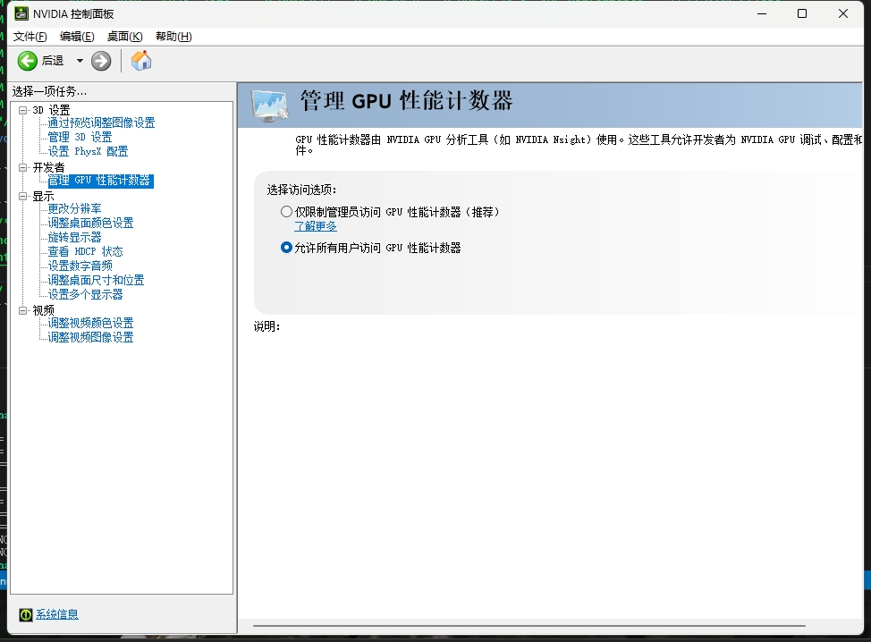

[第二章](./doc/02.md)

[第三章](./doc/03.md)

[第四章](./doc/04.md)

[第五章](./doc/05.md)

[第六章](./doc/06.md)

[第七章](./doc/07.md)

[第八章](./doc/08.md)

[第九章](./doc/09.md)

```c++
ncu  为所有用户启用访问权限

https://developer.nvidia.com/nvidia-development-tools-solutions-err_nvgpuctrperm-permission-issue-performance-counters

ncu 使用参考，可以不带参数

https://www.cnblogs.com/chenjambo/articles/using-nsight-compute-to-inspect-your-kernels.html#:~:text=Nsight%20C
```


