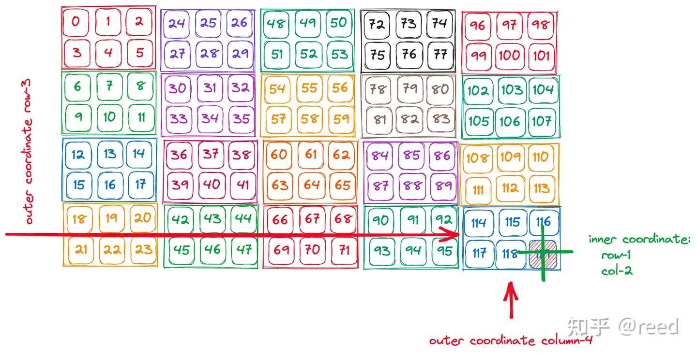
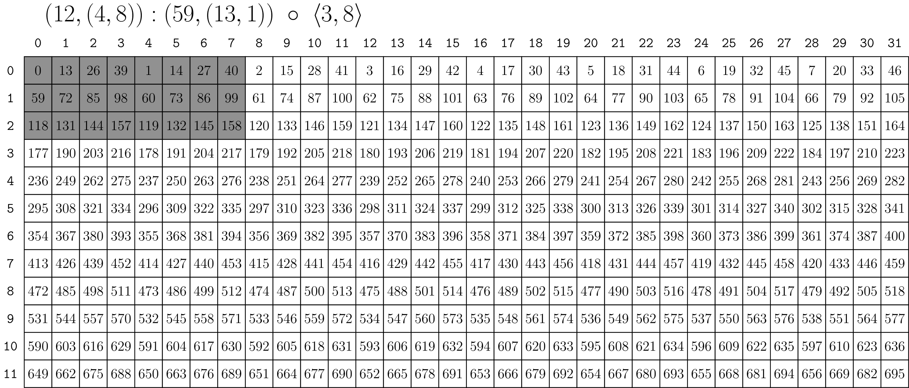
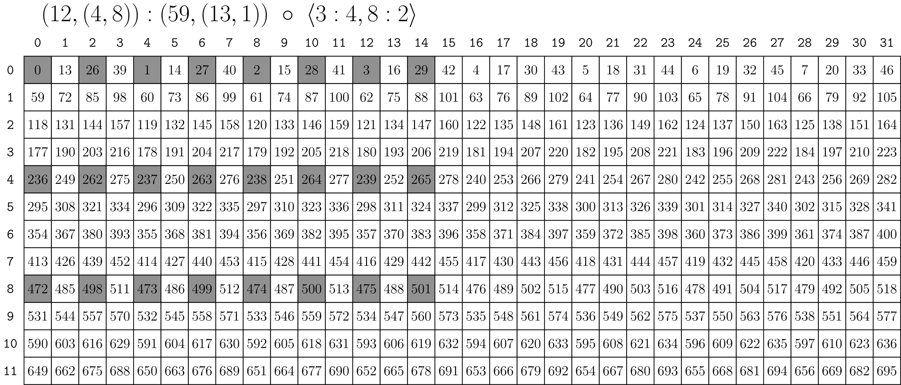
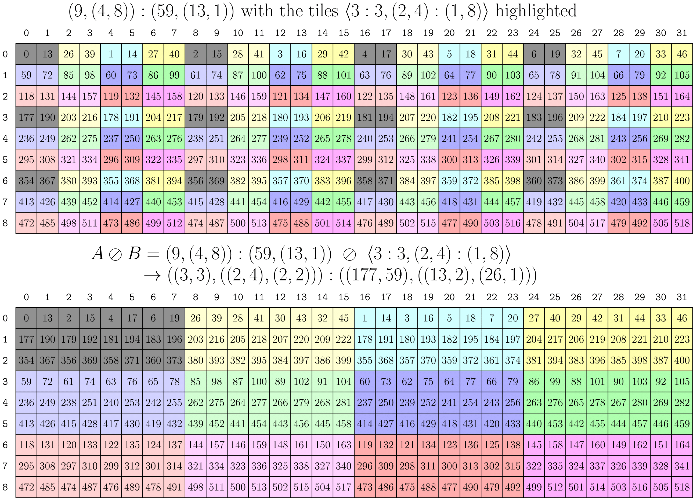



- [参考文档](#参考文档)
- [cute](#cute)
  - [参考文档](#参考文档-1)
  - [分割](#分割)
  - [切割计算](#切割计算)
  - [复合函数](#复合函数)
  - [拼接](#拼接)
  - [补码](#补码)
  - [除/分块](#除分块)
  - [Product(Tiling) （乘/分块）](#producttiling-乘分块)


# 参考文档

CUTLASS库使用与优化指北（一）

https://zhuanlan.zhihu.com/p/26869575907

# cute
## 参考文档

0. cute 的 shape stride 解析 [峰子的乐园](https://dingfen.github.io/2024/08/18/2024-8-18-cute/)
1. CuTe, shape 形状计算解析 [cnblog](https://www.cnblogs.com/Edwardlyz/articles/18368114)
2. cute 子块的切割 [zhihu](https://zhuanlan.zhihu.com/p/28356098779)
3. CuTe Layout Algebra 解析 [zhihu](https://zhuanlan.zhihu.com/p/22300321859)
4. CUDA 编程使用 Tensor core 详解 [zhihu](https://zhuanlan.zhihu.com/p/706494789)

5. 自底向上理解cute  [zhihu](https://zhuanlan.zhihu.com/p/8225904566)
6. cutlass源码导读（3）——核心软件抽象  [zhihu](https://zhuanlan.zhihu.com/p/595533802)
7. CUDA使用Tensor Core执行GEMM代码讲解——入门向 [zhihu](https://zhuanlan.zhihu.com/p/1888052343708308119)
8. 为什么加pad可以解bank conflict？ [zhihu](https://zhuanlan.zhihu.com/p/603016056)
9.  OpenAI-Triton学习仓库推荐 [zhihu](https://zhuanlan.zhihu.com/p/29006314571)
10. reed佬的  CUDA高性能编程 [zhihu](https://www.zhihu.com/column/c_1696937812497235968)
11. cute 之 Copy抽象 [zhihu](https://zhuanlan.zhihu.com/p/666232173)
12. 只推荐一个cuda c++项目 你会推荐哪一个？ [zhihu](https://www.zhihu.com/question/665380720/answer/92099035426)
13. CUTLASS CuTe实战(一)-基础 [zhihu](https://zhuanlan.zhihu.com/p/690703999)
14. CUDA shared memory避免bank conflict的swizzling机制解析 [zhihu](https://zhuanlan.zhihu.com/p/4746910252)


提供了 `cute::print`  打印

```c++
// 第零个块 第零个线程
// 头文件 cute/util/debug.hpp,
if (thread0()) {
  print(some_cute_object);
}
// 当第n 个块 第n个线程 返回 true
bool thread(int tid, int bid)


cute::print_layout()
cute::print_tensor()
cute::print_latex() // Layout, TiledCopy, and TiledMMA
```

## 分割

```bash
((2,2),2):((4,2),1)
      0   1
    +---+---+
 0  | 0 | 1 |
    +---+---+
 1  | 4 | 5 |
    +---+---+
 2  | 2 | 3 |
    +---+---+
 3  | 6 | 7 |
    +---+---+
#可以这样理解，在行维度上，我们有未知的子 tensor，该子 tensor 有两行（此为 shape 第一个2），
#行之间的 stride 为 4（所以 stride 第一个数为 4）；然后该子 tensor 在整个大 tensor 中会重
#复两次（此为 shape 的第二个 2），相对应地，子 tensor 间的 stride 为 2（此为 stride 的第二个 2）。

```
```bash
(8,(2,2)):(2,(1,16))
       0    1    2    3
    +----+----+----+----+
 0  |  0 |  1 | 16 | 17 |
    +----+----+----+----+
 1  |  2 |  3 | 18 | 19 |
    +----+----+----+----+
 2  |  4 |  5 | 20 | 21 |
    +----+----+----+----+
 3  |  6 |  7 | 22 | 23 |
    +----+----+----+----+
 4  |  8 |  9 | 24 | 25 |
    +----+----+----+----+
 5  | 10 | 11 | 26 | 27 |
    +----+----+----+----+
 6  | 12 | 13 | 28 | 29 |
    +----+----+----+----+
 7  | 14 | 15 | 30 | 31 |
    +----+----+----+----+

# 在列方向上，Shape 的第一个 2 表示，列内的子 tensor pattern 有两列，第二个 2 表示列一共有两个子 pattern 。
# Stride 的 1 表示在这个子 pattern 内的 stride 为 1，16 表示子 pattern 间的 stride 为 16

Layout (3, (2, 3)):(3, (12, 1))
       0     1     2     3     4     5     <== 1-D col coord
     (0,0) (1,0) (0,1) (1,1) (0,2) (1,2)   <== 2-D col coord (j,k)
    +-----+-----+-----+-----+-----+-----+
 0  |  0  |  12 |  1  |  13 |  2  |  14 |
    +-----+-----+-----+-----+-----+-----+
 1  |  3  |  15 |  4  |  16 |  5  |  17 |
    +-----+-----+-----+-----+-----+-----+
 2  |  6  |  18 |  7  |  19 |  8  |  20 |
    +-----+-----+-----+-----+-----+-----+
对于Tensor中的索引 17，有如下坐标
Coord: 16
Coord: (1, 5)
Coord: (1, (1, 2))
自然坐标与 Stride 做内积可以得到 index 索引。(1, (1, 2)) 与 (3, (12, 1)) 做内积为17


```

## 切割计算




[(2,4),(3,5)]:[(3,6),(1,24)]

阅读方式是冒号前是shape矩阵,冒号后是stride矩阵. 然后, 阅读方式是: (innner_row, outter_row), (inner_col, outter_col). (innner_stride_row, outtter_stride_row),(innner_stride_col, outter_stride_col);

坐标 [(a,b),(c,d)] 形状 [(s1,s2),(s3,s4)]:[(d1,d2),(d3,d4)]

坐标计算 [a,b] (*) [d1,d2]  + [c,d] (*) [d3,d4]

然后根据上面的计算公式: 假设目前给一个坐标[(1,3),(2,4)], 那么计算出来结果应该是:
[1,3] (*) [3,6]  + [2,4] (*) [1,24] = 3 + 18 + 2 +96 = 119

## 复合函数

```c++
// 复合函数
 /*
    A 矩阵 10行2列 步长16 4
    0    4
    16   20
    32   36
    48   52
    64   68
    80   84
    96   100
    112  116
    128  132
    144  148

    B 矩阵 5行4列  步长 1  5
    0   5  10  15
    1   6  11  16
    2   7  12  17
    3   8  13  18
    4   9  14  19

    结果矩阵，将a矩阵按照b矩阵的序号排列，形状相同， 形状[5,,(2,2)]:[16,(80,4)]
    0  80  4   84
    16 96  20 100
    32 112 36 116
    48 128 52 132
    64 144 68 148
    */
    Layout c = composition(a, b);

   //  (12,(4,8)):(59,(13,1))
    auto composition_src_2 = make_layout(make_shape(12, make_shape(4, 8)), make_stride(59, make_stride(13, 1)));
    // (8, 3)
    auto tiler = make_shape(Int<3>{}, Int<8>{});
    // Equivalent to <3:1, 8:1>
    // auto tiler = make_tile(Layout<_3,_1>{},  // Apply 3:1 to mode-0
    //                        Layout<_8,_1>{}); // Apply 8:1 to mode-1

    // (_3,(4,2)):(59,(13,1))
    //取子块，从composition_src_2 里面取tiler 的子块， 结果为 子块的形状跟步长
    auto composition_ret_2 = composition(composition_src_2, tiler);
    std::cout << "\r\n composition-2 \r\n";
    cute::print(composition_ret_2);


    // (12,(4,8)):(59,(13,1))
    auto composition_src_3 = make_layout(make_shape(12, make_shape(4, 8)), make_stride(59, make_stride(13, 1)));
    // <3:4, 8:2>
    auto tiler_3 = make_tile(Layout<_3, _4>{},    // Apply 3:4 to mode-0
                            Layout<_8, _2>{});   // Apply 8:2 to mode-1

    // (_3,(2,4)):(236,(26,1))
    //取子块 子块形状 3 行8列 ，行每隔4个取一个， 列每隔2个取一个。 结果为子块的形状
    auto composition_ret_3 = composition(composition_src_3, tiler_3);
    std::cout << "\r\n composition-3 \r\n";
    cute::print(composition_ret_3);


```




## 拼接

```bash
## 拼接

Layout a = Layout<_3,_1>{};                     // 3:1
Layout b = Layout<_4,_3>{};                     // 4:3
Layout ab = append(a, b);                       // (3,4):(1,3)
Layout ba = prepend(a, b);                      // (4,3):(3,1)
Layout c  = append(ab, ab);                     // (3,4,(3,4)):(1,3,(1,3))


### 拼接
Layout a = Layout<_3,_2>{};
Layout b = Layout<_4, _1>{};
Layout ab = append(a, b);
print_1d_layout(a); puts("");
print_1d_layout(b); puts("");
print_layout(ab); puts("");
/* 输出
0 2 4

0 1 2 3

(_3,_4):(_2,_1)
      0   1   2   3
    +---+---+---+---+
 0  | 0 | 1 | 2 | 3 |
    +---+---+---+---+
 1  | 2 | 3 | 4 | 5 |
    +---+---+---+---+
 2  | 4 | 5 | 6 | 7 |
    +---+---+---+---+
*/

# 我们可以从左往右，以Column Major的方式去解释这个操作：有一个列Layout3:2[0, 2, 4]，我们通过对它concate一个4:1的Layout来让它在行方向上重复4次，每次的步长为1，从而得到了一个新的二维Layout

# 根据官方文档Composition和Concatention是可交换的。拼接 与 复合 满足 交换律。

≈

```

##  补码

```bash
complement((2,2):(1,6), 24) is (3,2):(2,12)

## ((2,2):(1,6)

矩阵
0  6
1  7

在补足 24个数 情况下

0  6   ｜   12   18
1  7   ｜   13   19
--------------------
2  8   ｜   14   20
3  9   ｜   15   21
--------------------
4  10  ｜   16   22
5  11  ｜   17   23

这样理解： 结果是 3行2列 ， 步长是 2,12. 代表的是外层的外面的大矩阵是 3行2列，步长 分别为 2,12.   ((2,2):(1,6) 表示的是左上角小矩阵， 2 行 2 列 步长是 1 和 6 。
24 表示 24 个数的情况下。
```

## 除/分块

```bash

A = (4,2,3):(2,1,8)

0 2 4 6 |  1 3 5 7 |  |8 10 12 14 |  9 11 13 15 | | 16 18 20 22 | 17 19 21 23
                   |  |                         | |
                      |                           |
第一维 4个数， 每个数之间步长为2 。 第二维是 重复第一维 2 次， 每个数之间  步长为 1 。第三维重复前面2维 3次，  步长为8


B = 4:2

A / B

将 A 按照 B 重复 ， 取4个， 每隔2个取一个，重复这种取法 结果为

0 4 1 5  | 2 6 3 7 | 8 12 9 13 | 10 14 11 15 | 16 20 17 21 |  18 22 19 23

结果为 ((2,2),(2,3)):((4,1),(2,8))

```


可以理解为： 在列方向应用3:3， 列方向 取三次，每次间隔为3。  行方向应用(2,4):(1,8)。 行方向，第一维 是两个数，每个取相邻的数，因为步长为1。 重复4次，开始第2维，第二维间隔8个数，因为步长为8。
在test.cu里面的test_03函数

## Product(Tiling) （乘/分块）
没看懂 Logical product。 blocked_product 比较好理解

product 的几种形式 [csdn](https://blog.csdn.net/qq_33146555/article/details/130658810)


